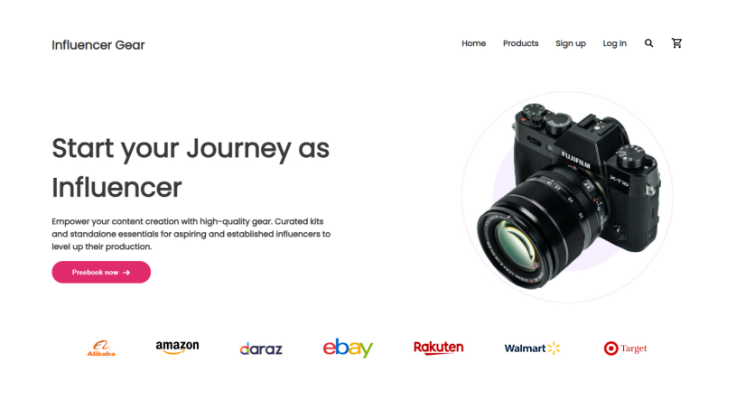

# 📸 Influencer Gear

A modern, responsive, and visually aesthetic landing page designed for aspiring influencers to find the best gear. This project showcases a curated collection of cameras, microphones, lighting, and other essential equipment for content creation.

---
## 🌐 Live Preview & Interface

[👉 Click here to view the live site]()

---

## 🚀 Features

* **Hero Section:** High-impact visual with a clear Call-to-Action (CTA) and smooth entry animations.
* **Trusted Partners:** Logo slider/grid featuring top retailers like Amazon, eBay, and Rakuten.
* **Product Catalog:** A structured "Popular Collection" grid featuring:
    * Dynamic price tags and interactive star ratings.
    * Shipping & Buyer protection status with hover effects.
* **Featured Section:** A dedicated area for highlighted products with descriptive text and balanced layout.
* **Responsive Footer:** Includes social media links and copyright information for a complete user experience.
* **Engaging Animations:** Applied custom **CSS Transitions and Keyframe Animations** across all sections to ensure a fluid and interactive browsing experience.

---

## 🛠️ Tech Stack

* **HTML5:** Semantic structure.
* **CSS3:** Custom styling, Flexbox, and CSS Grid for the product layout.
* **Google Fonts:** Used for modern typography (e.g., Poppins or Inter).
* **FontAwesome:** For social media and UI icons.
* **JavaScript:** Used for DOM manipulation to make buttons clickable and add basic interactivity.

## 📦 Included Products

| Product | Price | Features |
| :--- | :--- | :--- |
| **Flex Tripod** | $50.48 | 4.99 Rating, Worldwide shipping |
| **Vlogging Camera** | $1800.80 | Professional grade, Buyer protection |
| **Microphone** | $120.25 | Studio quality, Buyers protection possible |
| **Airbuds** | $100.00 | High quality, 4.99 Rating |
| **Drone** | $980.25 | 4K Ready, Worldwide shipping |
| **Light Setup** | $1200.00 | Professional lighting, High quality |
| **Photoshoot set** | $820.40 | Complete setup, Worldwide shipping |
| **Green Screen** | $25.48 | Affordable, High quality materials |
| **Action Camera** | $380.00 | Waterproof, 4.99 Rating |

